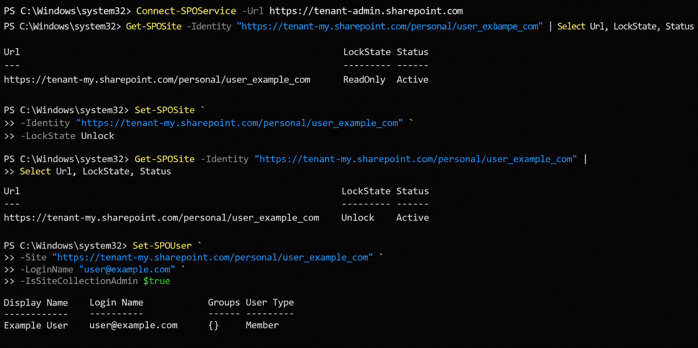

# OneDrive Recovery and Administrative Access Assignment

## Overview

This project demonstrates how SharePoint Online PowerShell was used to recover access to a former employee's OneDrive account and assign administrative permissions for business continuity and data retrieval.

## Technologies Used

* Microsoft 365
* SharePoint Online
* OneDrive for Business
* PowerShell
* SharePoint Online Management Shell

## Business Scenario

A former employee's OneDrive contained business-critical files that needed to be reviewed and transferred to management.

The OneDrive site was locked in a ReadOnly state, preventing administrative access. Using SharePoint Online PowerShell, the site was unlocked and Site Collection Administrator permissions were assigned to an authorized employee.

## Steps Performed

### 1. Connect to SharePoint Online

```powershell
Connect-SPOService -Url "https://tenant-admin.sharepoint.com"
```

### 2. Verify OneDrive Site Status

```powershell
Get-SPOSite -Identity "https://tenant-my.sharepoint.com/personal/user_company_com" |
Select Url, LockState, Status
```

### 3. Remove ReadOnly Restriction

```powershell
Set-SPOSite `
-Identity "https://tenant-my.sharepoint.com/personal/user_company_com" `
-LockState Unlock
```

### 4. Assign Site Collection Administrator

```powershell
Set-SPOUser `
-Site "https://tenant-my.sharepoint.com/personal/user_company_com" `
-LoginName "admin@company.com" `
-IsSiteCollectionAdmin $true
```

## Results

* Connected to SharePoint Online Administration Center
* Verified OneDrive site status
* Removed ReadOnly restrictions
* Assigned Site Collection Administrator permissions
* Restored access to business-critical files

## Skills Demonstrated

* Microsoft 365 Administration
* SharePoint Online Administration
* OneDrive for Business Management
* PowerShell Automation
* Identity and Access Management (IAM)
* Administrative Permissions Management
* Business Continuity Operations

## Project Structure

```text
Recover-OneDrive-Admin-Access/
├── README.md
├── scripts/
│   └── Recover-OneDrive.ps1
└── screenshots/
    └── OneDrive-Recovery-Process.png
```

## Screenshot



## Key Takeaway

This project demonstrates a common Microsoft 365 administrative task involving OneDrive recovery, SharePoint Online administration, and permission management using PowerShell.
