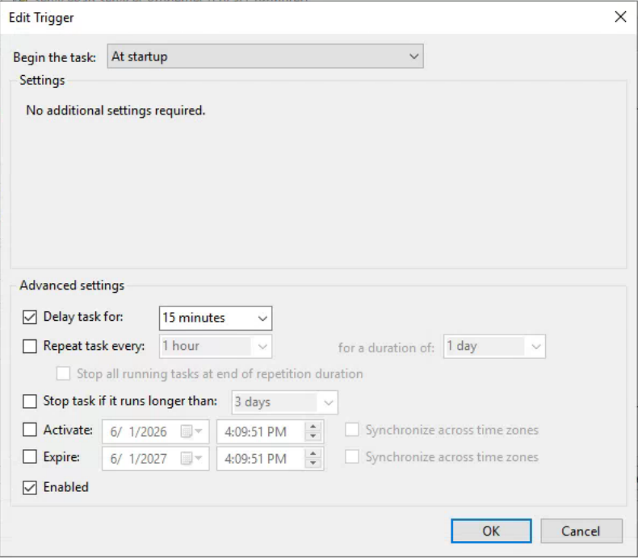

# SalesPad EDI Service Auto-Recovery

## Overview

This project automates the startup and recovery of the SalesPad EDI Service on Windows Servers using a batch script and Windows Task Scheduler.

The solution ensures that the service is automatically started after server reboots, maintenance activities, or unexpected outages.

---

## Business Problem

The SalesPad EDI Service is critical for business operations.

If the service fails to start after a reboot, manual intervention is required, resulting in downtime and operational delays.

---

## Solution

A Scheduled Task executes a batch script during system startup.

The script:

* Checks the status of the SalesPad EDI Service.
* Determines if the service is running.
* Starts the service if stopped.
* Records all activity to a log file.

---

## Environment

### Servers

* HS2

### Service

SalesPad EDI Service - Penix

### Service Account

SYSTEM

### Script Location

```text
C:\temp\Scripts\SalesPad.bat
```

### Log File

```text
C:\Scripts\SalesPadEDI.log
```

### Trigger

```text
At Startup
```

---

## Project Structure

```text
SalesPad-EDI-Service-AutoRecovery
│
├── README.md
├── SOP
├── Scripts
├── Logs
└── Screenshots
```
## Screenshots

### Scheduled Task Configuration





### Deployment


### Logging


---

## Skills Demonstrated

* Windows Server Administration
* Task Scheduler Configuration
* Batch Scripting
* Service Monitoring
* Service Recovery
* Troubleshooting
* Operational Documentation

---

## Results

* Reduced manual intervention
* Improved service availability
* Automated startup recovery
* Standardized operational procedure

---

## Documentation

See the SOP folder for complete implementation details.
